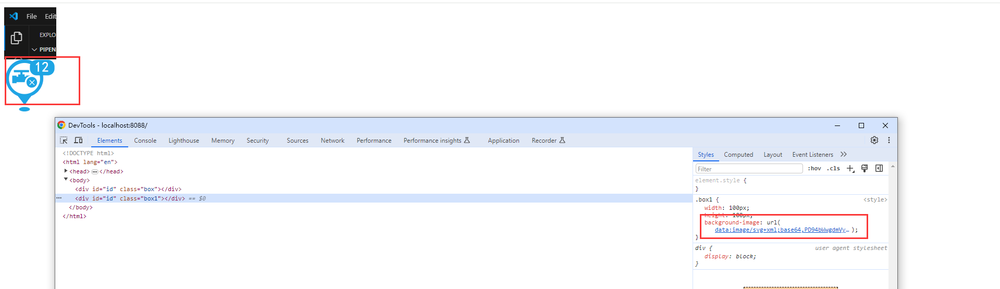

# webpak 的基础介绍

代码仓库：<https://gitee.com/ywx-qwe/webpack-study.git>

## 概念介绍

webpack 被定义为现代 JavaScript 应用程序的静态模块打包器(module bundler)，是目前最为流行的 JavaScript 打包工具之一。

webpack 会以一个或多个 js 文件为入口，递归检查每个 js 模块的依赖，从而构建一个依赖关系图(dependency graph)，然后依据该关系图，将整个应用程序打包成一个或多个 bundle。

由于 webpack 是用 nodejs 编写的，所以它依赖的运行环境就是 nodejs。也正因为这一点，webpack 只能识别 JavaScript，所有非 JavaScript（包括 HTML，CSS，Typescript 等）编写的文件都需要经过处理，这是借助对应的 loader 实现的。

webpack 使用的是 nodejs 默认的模块系统：commonjs，借助 nodejs 提供的 API 来操作待打包项目的源文件（如 fs 模块、path 模块等）。webpack 将这些文件整合压缩后，输出到一个特定的目录下（通常是 dist）。处理过的 dist 一般会被直接上传到静态资源服务器使用。

## 核心的元素

&#x20;**1.Entry**

&#x20;指以哪个文件为入口，构建内部的依赖图

&#x20;**2.output**

打包后的 bundles 会存放在哪个文件夹

&#x20;**3.module**

&#x20;处理非 js 的文件，因为 webpack 只能够识别 js

&#x20;**4.plugins**

&#x20;执行更多的业务，一些打包的优化等

&#x20;**5.Mode**

&#x20;是值进行的模式，有两种，一种是 development(开发模式) production（生产模式）

### **Entry**

```javascript
entry: path.join(__dirname, '/src/index.js'),  //输入文件
```

### **loader**

&#x20;loaders 的配置包括以下几方面：

- test：一个用以匹配 loaders 所处理文件的拓展名的正则表达式（必须）
- loader：loader 的名称（必须）或者 use（多个 loader）
- include/exclude：手动添加必须处理的文件（文件夹）或屏蔽不需要处理的文件（文件夹）（可选）；
- options：为 loaders 提供额外的设置选项（可选）

## 资源处理

### **处理样式语言**

```javascript
 //处理css文件
{ test:/\.css$/, use:['style-loader','css-loader'] //从右往左执行 },
//处理less文件
 { test:/\.less$/, use:['style-loader','css-loader','less-loader'] },
//处理sass,scss文件
{ test:/\.s[ac]ss$/, use:['style-loader','css-loader','sass-loader'] }
```

#### **提取 css 为单独文件**&#x20;

css 最开始是会打包到 js 文件里面的，当 js 文件加载的时候，创建一个 style 标签去生成，这样可能会出现闪屏的现象

并且支持 CSS 和 SourceMaps 的按需加载，==注意不要与 style-loader 一起使用==

==现在需要生产单独的文件，用 link 标签进行引入==

使用`mini-css-extract-plugin`插件

```javascript
npm install --save-dev mini-css-extract-plugin
```

配置，处理样式的 loader 加上`MiniCssExtractPlugin.loader`，然后再 plugins 里面再加上`MiniCssExtractPlugin`

```javascript
const MiniCssExtractPlugin = require("mini-css-extract-plugin");
 module:{
    //loader配置再rules里面
    rules:[
      //处理css文件
      {
        test:/\.css$/,
        use:[MiniCssExtractPlugin.loader,'css-loader'] //从右往左执行
      },
    //配置插件
  plugins:[
    //提取css文件
    new MiniCssExtractPlugin({
      filename:'static/css/[name].css'
    })
  ],
}
```

#### **css 样式兼容**

使用`postcss-loader`和`postcss`,会自动加入一些兼容性的代码

**下载**

```javascript
npm install --save-dev postcss-loader postcss postcss-preset-env
```

\*\*配置 \*\*在处理 css 文件里面加入`postcss-loader`并且设置预设，也可以新建一个`postcss.config.js` 文件

```javascript
module: {
  //loader配置再rules里面
  rules: [
    //处理css文件
    {
      test: /\.css$/,
      use: [
        MiniCssExtractPlugin.loader,
        "css-loader",
        "css-loader",
        {
          loader: "postcss-loader",
          options: {
            postcssOptions: {
              plugins: [
                [
                  "postcss-preset-env",
                  {
                    // 其他选项
                  },
                ],
              ],
            },
          },
        },
      ], //从右往左执行
    },
  ];
}
```

==可以在 package.json 里面设置需要兼容的浏览和浏览器版本==

`package.json`

```json
"browserslist":[
    "last 2 version",
    "> 1%",
    "not dead"
 ]
```

#### **封装处理样式资源的 loader**

```javascript
//封装处理样式的loader
function getStyleLoader(pre) {
  return [
    MiniCssExtractPlugin.loader,
    "css-loader",
    {
      loader: "postcss-loader",
      options: {
        postcssOptions: {
          plugins: [["postcss-preset-env"]],
        },
      },
    },
    pre,
  ].filter(Boolean); //从右往左执行
}
```

#### **css 压缩**

使用`css-minimizer-webpack-plugin`插件

```javascript
 npm install css-minimizer-webpack-plugin --save-dev
```

**配置**

```javascript
const CssMinimizerPlugin = require('css-minimizer-webpack-plugin');
optimization: {
    minimizer: [
      // 在 webpack@5 中，你可以使用 `...` 语法来扩展现有的 minimizer（即 `terser-webpack-plugin`），将下一行取消注释
      // `...`,
      new CssMinimizerPlugin(),
    ],
    minimize: true,//该配置是在生产模式下才生效，需要加入这个使其在开发模式下也生效
  },
//或者在plugins里面加入
  plugins:[
    new CssMinimizerPlugin()
  ],
```

### **处理 js 的资源**

&#x20;使用**babel-loader，[Eslint]()**

```javascript
//被指babel,处理js文件，能够兼容更加高级的js，es6....等，还有core.js,让你能使用基于 JavaScript 进行了拓展的语言，比如 React 的 JSX
 {
  test:/\.js$/,
  loader:'babel-loader',
  include:['/src']
  }
```

#### **Eslint**

==js 和 jsx 的检查工具==

首先需要安装插件

```javascript
npm install eslint-webpack-plugin --save-dev

```

webpack.config.js 配置插件

```javascript
const ESLintPlugin = require('eslint-webpack-plugin');
  //配置插件
  plugins:[
    // 安装eslint插件,配置.eslintrc文件
    new ESLintPlugin({
      context:path.resolve(__dirname,"src")
    })
  ],
```

创建.eslintrc.js 文件，配置内容查官网

```javascript
// eslintrc.js
module.exports = {
  extends: ["eslint:recommended"], //继承官方的
  env: {
    node: true,
    browser: true, //是否启用console.log
  },
  parserOptions: {
    ecmaVersion: 6, //es版本
    sourceType: "module", // es module
  },
  rules: {
    "no-var": 2, //不能使用var变量
  },
};
```

创建忽略监测的文件.eslintignore,不监测 dist 下的

```javascript
dist;
```

#### Babel

主要是将 es6 语法转换为向后兼容的 js 语言，可以运行在旧版浏览器和其他环境当中，详细用法看官网

**下载**

```javascript
   npm install -D babel-loader @babel/core @babel/preset-env
```

1.需要配置配置文件，新建配置文件 babel.config.js,babel 会自动读取

2.具体配置如下：

**webpack.config.js**

```javascript
//被指bable,处理js文件，能够兼容更加高级的js，es6....等，还有core.js,让你能使用基于 JavaScript 进行了拓展的语言，比如 React 的 JSX
    {
          test: /\.js$/,
          exclude: /node_modules/,//不处理node_modules文件
          // use: {
            loader: 'babel-loader',
            // options: {
            //   presets: ['@babel/preset-env'],//可以在babel.config.js
            // },
          // },
    },
```

&#x20; **bable.config.js**

```javascript
module.exports = {
  //预设
  // @babel/preset-env 智能预设  用于编译 ES2015+ 语法
  // @babel/preset-typescript 编译ts
  // babel/preset-react 编译react的jsx的语法
  //
  presets: ["@babel/preset-env"], //预设
};
```


**预设**

- @babel/preset-env 智能预设 用于编译 ES2015+ 语法 &#x20;
- @babel/preset-typescript 编译 ts
- @babel/preset-react 编译 react 的 jsx 的语法

##### **减少 babel 生成文件的体积**

==babel 会为编译的文件加入辅助代码，会导致文件体积变大,可以将辅助代码单独作为一个模块，避免重复引入==

使用**babel/plugin-transform-runtime**:禁止对每个文件都注入 runtime,而是通过引入**babel/plugin-transform-runtime**，并且使用的所有的辅助代码都从这个引入

```javascript
npm install -D @babel/plugin-transform-runtime
```

**配置** plugins: \['@babel/plugin-transform-runtime']

```javascript
 {
          test: /\.js$/,
          exclude: /node_modules/,//不处理node_modules文件
          // use: {
            loader: 'babel-loader',
            plugins: ['@babel/plugin-transform-runtime'],
            // options: {
            //   presets: ['@babel/preset-env'],//可以在babel.config.js
            // },
          // },
        },
```


#### **js 和 html 压缩**

在生产模式下会自动打开`js`和`html`压缩，不需要做额外的处理

### &#x20;**处理图片的资源**

&#x20;再 webpack4 里面使用**file-loader**和**url-loader** ,**file-loader**是将图片编译成可以识别的资源，**url-loader**是将一些较小的资源转换为 base64

&#x20;webpack5 的这两个这个已经是内置的的配置了

&#x20;webpack5:资源模块(asset module)是一种模块类型，它允许使用资源文件（字体，图标等）而无需配置额外 loader。

```typescript
 //处理图片资源，，webpack 将按照默认条件，自动地在 resource 和 inline 之间进行选择：小于 8kb 的文 件，将会视为 inline 模块类型，否则会被视为 resource 模块类型， //有三种类型选择 asset,asset/resource,asset/inline // asset就是就是会在尺寸(默认8kb)是多少会进行base64转换，直接URL进行注入 //asset/resource 进行就是单独一个文件，asset/inline 是转换为base64,可以减少请求
{
 test: /\.(png|jpe?g|gif|svg)(\?.*)?$/,
 type:'asset',
   //生成的结果
 generator:{
    //hash是生成的hash值，hash:10 取前十位
     //ext 是指后缀
     //query 是携带的参数
     //输出路径和名称
     filename:"static/assets/[hash:10][ext][query]"
        },
 parser: { dataUrlCondition: { maxSize: 10 * 1024 // 4kb } }
}
```




### **处理字体，其他等资源,原封不动输出**

```javascript
      {
        test: /\.(tff|woff2|map4|map3)(\?.*)?$/,
        type:'asset/resource',//不需要转成base64
        //生成的结果
        generator:{
          //hash是生成的hash值，hash:10 取前十位
          //ext 是指后缀
          //query 是携带的参数
         filename:"static/assets/[hash:10][ext][query]"
        }
      }
```

### **处理 html 资源**

该插件将为你生成一个 HTML5 文件， 在 body 中使用  `script`  标签引入你所有 webpack 生成的 bundle，如果存在多个入口也会

在生成 HTML 文件中的  `<script>`  标签内引入，在 webpack 的输出中有任何 CSS 资源（例如，使用  [MiniCssExtractPlugin](https://www.webpackjs.com/plugins/mini-css-extract-plugin/)  提取的 CSS），那么这些资源也会在 HTML 文件  `<head>`  元素中的  `<link>`  标签内引入

**安装**

```javascript
npm install --save-dev html-webpack-plugin
```

**配置**

```javascript
const HtmlWebpackPlugin = require('html-webpack-plugin');

 plugins:[
    // 安装eslint插件,配置.eslintrc文件
    new ESLintPlugin({
      context:path.resolve(__dirname,"src")
    }),
    new HtmlWebpackPlugin({
      //以public下的index.html为模板，将输出的资源加上去，其他的不变
      template:path.resolve(__dirname,"public/index.html")
    })
  ],
```

**生成文件**

/dist/index.html

```html
<!DOCTYPE html>
<html>
  <head>
    <meta charset="utf-8" />
    <title>Webpack App</title>
    <meta name="viewport" content="width=device-width, initial-scale=1" />
    <script defer src="/dist/static/js/bundle.js"></script>
  </head>
  <body></body>
</html>
```

## 高级的使用

### 提高 webpack 的打包速度

#### **热模块(HMR)**

修改某个模块，webpack 会将所有的文件都重新编译一遍，需要做到只去重新打包更改的模块代码

`HotModuleReplacement`在程序运行中，替换，删除，添加模块，不需要重新加载整个页面

样式是具有这个功能，js 还没有实现，但是 react 和 vue 相关的`vue-loader`，`react-hot-loade`r 已经对这个进行了处理

需要在引入模块的是加入以下代码

```javascript
import { sum } from "./js/sum";
import "./style/a.less";
import "./style/b.css";
import "./style/c.scss";
const a = [1, 2, 3].map((m) => m);
console.log(a);
const b = [1, 2, 3].reduce((a, b) => {
  return a + b;
}, 0);
console.log(b);
console.log(sum());
//是否支持热模块
if (module.hot) {
  module.hot.accept("./js/sum");
}
```

**配置**：

```javascript
  devServer: {
        hot:true//开启HMR
  },
```

#### **oneOf**

在打包的时候时候，每个文件都会经历每个 loader 的处理，导致会处理的很慢

使用 oneOf 可以让文件来使用一个 loader 处理后，就停止了，使用 oneOf 进行包裹

```javascript
  module:{
    //loader配置再rules里面
    rules:[
      {
        oneOf:[
          //处理css文件
          {
            test:/\.css$/,
            use:getStyleLoader([])
          },
          //处理less文件
          {
            test:/\.less$/,
            use:getStyleLoader(['less-loader'])
          },
          //处理sass,scss文件
          {
            test:/\.s[ac]ss$/,
            use:getStyleLoader(['sass-loader'])
          },
          //被指bable,处理js文件，能够兼容更加高级的js，es6....等，还有core.js,让你能使用基于 JavaScript 进行了拓展的语言，比如 React 的 JSX
            {
              test: /\.js$/,
              exclude: /node_modules/,//不处理node_modules文件
              // use: {
                loader: 'babel-loader',
                options: {
                  // presets: ['@babel/preset-env'],//可以在babel.config.js
                  plugins: ['@babel/plugin-transform-runtime'],
                },
              // },
            },
          //处理图片资源，，webpack 将按照默认条件，自动地在 resource 和 inline 之间进行选择：小于 8kb 的文件，将会视为 inline 模块类型，否则会被视为 resource 模块类型，
          //有三种类型选择 asset,asset/resource,asset/inline
          // asset就是就是会在尺寸(默认8kb)是多少会进行base64转换，直接URL进行注入
          //asset/resource 进行就是单独一个文件，asset/inline 是转换为base64,可以减少请求
          {
            test: /\.(png|jpe?g|gif|svg)(\?.*)?$/,
            type:'asset',
            //生成的结果
            generator:{
              //hash是生成的hash值，hash:10 取前十位
              //ext 是指后缀
              //query 是携带的参数
            filename:"static/assets/[hash:10][ext][query]"
            },
            parser: {
              dataUrlCondition: {
                maxSize: 10 * 1024 // 4kb
              }
            }
          },
          //处理字体文件
          {
            test: /\.(tff|woff2)(\?.*)?$/,
            type:'asset/resource',//不需要转成base64
            //生成的结果
            generator:{
              //hash是生成的hash值，hash:10 取前十位
              //ext 是指后缀
              //query 是携带的参数
            filename:"static/assets/[hash:10][ext][query]"
            }
          }
        ]
      }
    ]
  },
```

#### **include 和 exclude**

在插件和 loader 里面可以设置 include 和 exclude 来控制处理哪些文件或者不处理哪些文件，具体配置如下：

```javascript
    new ESLintPlugin({
      context:path.resolve(__dirname,"src"),
      exclude:'node_modules'
    }),
```

```javascript
 {
              test: /\.js$/,
              exclude: /node_modules/,//不处理node_modules文件
              // use: {
                loader: 'babel-loader',
                options: {
                  // presets: ['@babel/preset-env'],//可以在babel.config.js
                  plugins: ['@babel/plugin-transform-runtime'],
                },
              // },
            },
```

#### **eslint 和 babel 的缓存**

对 eslint 和 babel 的处理结果进行缓存，第二次编译更快，使用`cache`

1.开启 babel 缓存，`cacheDirectory`开启缓存，`cacheCompression`关闭缓存压缩，在生产打包的时候是不需要的，不会增大体积

```javascript
 {
              test: /\.js$/,
              exclude: /node_modules/,//不处理node_modules文件
              // use: {
                loader: 'babel-loader',
                options: {
                  // presets: ['@babel/preset-env'],//可以在babel.config.js
                  plugins: ['@babel/plugin-transform-runtime'],
                  cacheDirectory:true, //开启bable缓存
                  cacheCompression:false,//关闭缓存压缩
                },
              // },
    },
```

2.开启 eslint 的缓存，`cache`开启缓存，`cacheLocation`缓存的位置

```javascript
 new ESLintPlugin({
      context:path.resolve(__dirname,"src"),
      exclude:'node_modules',
      cache:true, //开启缓存
      cacheLocation:path.resolve(__dirname,"../node_module/.cache/eslintcache") //配置缓存的位置
    }),
```


#### **多进程打包 Thread**

当项目比较庞大的时候，我们主要是提升 js 的打包速度，可以通过多进程对 js 进行打包，加快速度

多进程打包：开启电脑的多个进程去干一件事情

**注意**：需要再特别耗时的情况下使用，因为每个进程的开始是需要 600ms 左右的，启用进程是获得`cpu`的核数

1.获取 cpu 的核数

```javascript
const os = require("os");
const threads = os.cpus().length - 1;
```

2.给 babel 配置多进程

```javascript
//下载thread-loader
npm i thread-loader -D
//配置
 {
              test: /\.js$/,
              exclude: /node_modules/,//不处理node_modules文件
              use: [
                {
                loader: 'babel-loader',
                options: {
                  // presets: ['@babel/preset-env'],//可以在babel.config.js
                  plugins: ['@babel/plugin-transform-runtime'],
                  cacheDirectory:true, //开启bable缓存
                  cacheCompression:false,//关闭缓存压缩
                },
              },
               // 开启多进程
              {
                loader: 'thread-loader',
                options: {
                  works:threads //开启几个
                },
              },
            ]
            },
```

2.给 eslint 开启多进程

```javascript
 new ESLintPlugin({
      context:path.resolve(__dirname,"src"),
      exclude:'node_modules',
      cache:true, //开启缓存
      cacheLocation:path.resolve(__dirname,"../node_module/.cache/eslintcache"), //配置缓存的位置
      threads:threads //开启多进程
    }),
```

### 减少代码打包的体积

#### **减少 babel 的体积**

见处理[js 资源的 babel]()

#### **TreeShaking**

移除 js 中没有使用的代码，不打包进去

webpack 已经默认开启这个配置，不需要做额外的处理

**注意：依赖 es module**

#### **压缩图片**

使用`image-minimizer-webpack-plugin`本地的静态的图片需要压缩

图片压缩分为==有损压缩==和==无损压缩==

1.下载插件

```javascript
npm install image-minimizer-webpack-plugin --save-dev
```

- 无损压缩

  ```javascript
  npm install imagemin-gifsicle imagemin-jpegtran imagemin-optipng imagemin-svgo --save-dev
  ```

- 有损压缩

  ```javascript
  npm install imagemin-gifsicle imagemin-mozjpeg imagemin-pngquant imagemin-svgo --save-dev

  ```

  2.配置

```javascript
  optimization: {
    minimizer: [
      new ImageMinimizerPlugin({
        minimizerOptions: {
          implementation:ImageMinimizerPlugin.imageminGenerate,
          plugins: [
            ['gifsicle', { interlaced: true }],
            ['jpegtran', { progressive: true }],
            ['optipng', { optimizationLevel: 5 }],
            // Svgo configuration here https://github.com/svg/svgo#configuration
            [
              'svgo',
              {
                plugins: extendDefaultPlugins([
                  {
                    name: 'removeViewBox',
                    active: false,
                  },
                  {
                    name: 'addAttributesToSVGElement',
                    params: {
                      attributes: [{ xmlns: 'http://www.w3.org/2000/svg' }],
                    },
                  },
                ]),
              },
            ],
          ],
        },
      }),
    ],
    minimize: true,
  },
```

### 优化代码运行

#### **代码分割 CodeSplit 多入口**

现在是所有的代码都打包在一个 js 文件里面，需要将 js 分割成不同的的文件，实现**按需加载**

1.  **多入口**

    设置多个入口文件，在`entry`里面设置多个入口，分开打包

    output 设置输出文件

    ```javascript
      entry:{
        index:path.join(__dirname, '/src/index.js'),
        app:path.join(__dirname, '/src/app.js')
      },
        output: {
    		path: path.join(__dirname, 'dist'),
    		publicPath: '/dist/',  //输出路径
    		filename: 'static/js/[name].js', //输出文件,放在static/js文件夹，将js的文件放在这里
        clean:true,//清除上次打包的内容
    	},

    ```

    

2.  **提出公共代码的部分**

    在多入口的时候去使用同一个模块的时候，会导致打包两次，我们需要将这个公共使用的代码只打包一次

    需要在`optimization`进行配置

    ```javascript
      optimization: {
          splitChunks: {
            chunks: 'all',
            //默认值
            // minSize: 20000,//分割代码的最小的大小
            // minRemainingSize: 0,
            // minChunks: 1,//至少使用的次数
            // maxAsyncRequests: 30,//同时加载的次数
            // maxInitialRequests: 30,
            // enforceSizeThreshold: 50000,//超过50kb就单独打包
            // cacheGroups: {//组，哪些文件打包在一起
            //   defaultVendors: {
            //     test: /[\\/]node_modules[\\/]/,
            //     priority: -10,
            //     reuseExistingChunk: true,
            //   },
            //   default: {
            //     minChunks: 2,
            //     priority: -20,
            //     reuseExistingChunk: true,
            //   },
            // },
            cacheGroups: {
              // defaultVendors: {
              //   test: /[\\/]node_modules[\\/]/,
              //   priority: -10,
              //   reuseExistingChunk: true,
              // },//组，哪些文件打包在一起
              default: {
                minSize:0,//打包的最小的体积
                minChunks: 2,
                priority: -20,
                reuseExistingChunk: true,
              },
            },
          },
        minimize: true,
      },
    ```

    

3.  **按需加载和动态导入**

    使用 import 动态导入

    ```javascript
    document.getElementById("btn").onclick = function () {
      //动态导入语法
      import("./js/sum")
        .then((r) => {
          console.log(r);
        })
        .catch((e) => {
          console.log(e);
        });
    };
    ```

4.  单入口文件

    我们有许多应用是单页面应用，只有一个入口，这里我们也是需要设置单入口

    ```javascript
    entry: path.join(__dirname, "/src/index.js");
    ```

5.  **模块命名**

    需要给提取出来的模块进行命名

    - 给动态导入的模块进行命名

      加入`webpackChunkName`取名字

      在 output 里面加入 chunkFilename

      ```javascript
        output: {
      		path: path.join(__dirname, 'dist'),
      		publicPath: '/dist/',  //输出路径
      		filename: 'static/js/[name].js', //输出文件,放在static/js文件夹，将js的文件放在这里
              clean:true,//清除上次打包的内容
              //给打包输出的其他文件进行命名
              chunkFilename:'static/js/[name].js'
      	},
      ```

      ```javascript
      import(/* webpackChunkName:'sum' */ "./js/sum")
        .then((r) => {
          console.log(r);
        })
        .catch((e) => {
          console.log(e);
        });
      ```

    - &#x20;统一模块命名

      js 输出文件的统一命名，使用 chunkFilename

      ```javascript
       output: {
      		path: path.join(__dirname, 'dist'),
      		publicPath: '/dist/',  //输出路径
      		filename: 'static/js/[name].js',
             //给打包输出的其他文件进行命名
              chunkFilename:'static/js/[name].chunk.js', //加入chunk区分主文件
      	},
      ```

      css 文件的统一命名

      ```javascript
      new MiniCssExtractPlugin({
            filename:'static/css/[name].css',
            chunkFilename:'static/css/[name].chunk.css'
          }),
      ```

      图片其他资源的统一命名 `assetModuleFilename`

      ```javascript
      output: {
          //通过type:asset处理的资源
          assetModuleFilename:'static/assets/[hash:10][ext][query]'
      	},
      ```

#### **preload 和 prefetch**

`preload`和`prefetch`是控制资源的加载方式，加载资源并且不执行，`preload`的优先级大于`prefetch`,

`preload`是加载当前页面的资源，`prefetch`可以加载当前也可以加载下一个页面

- `preload` 浏览器立即加载
- `prefetch` 浏览器空闲的时候加载
- 使用场景：当前页面的优先级高的时候使用`preload`加载，下一个页面使用的资源用`prefetch`
- `preload`的兼容性大于`prefetch`

  下载

  ```javascript
  npm i @vue/preload-webpack-plugin
  ```

  ```javascript
  const PreloadWebpackPlugin = require("@vue/preload-webpack-plugin");
  new PreloadWebpackPlugin({
    rel: "preload", //设置加载的方式
    as: "script", //处理的优先级
  });

  //prefetch
  new PreloadWebpackPlugin({
    rel: "prefetch",
  });
  ```

#### **NetWork Cache**

因为前后输出的文件名是一样的，都叫`main.js`，一旦将来发布新版本，因为文件名没有变化导致浏览器会直接读取缓存，不会加载新资源，项目也就没法更新了

每次更新都生产新的文件名就可以更新文件了，在文件名生产唯一的 hash 值

```javascript
  output: {
		path: path.join(__dirname, 'dist'),
		publicPath: '/dist/',  //输出路径
		filename: 'static/js/[name].[contenthash:8].js', //输出文件,放在static/js文件夹，将js的文件放在这里
        //给打包输出的其他文件进行命名
       chunkFilename:'static/js/[name].[contenthash:8].chunk.js', //加入chunk区分主文件
	},
```

但是重新打包的时候某个文件所依赖的文件名也是重新变了，会导致 a 引入 b,但是只有 b 发生变化的时候会导致 a 也会重新编译变化，但是 a 不应该变化

需要取缓存 hash 值，需要配置

```javascript
optimization: {
	// 提取runtime文件
    runtimeChunk: {
      name: (entrypoint) => `runtime~${entrypoint.name}`, // runtime文件命名规则
    },
}
```


#### **Core-js**

`core-js`是专门用来做`ES6`以及以上`API `的`polyfill`(补丁)。

babel 实现对箭头函数等的兼容，但是像 async，promise 还存在兼容性的问题，coreJs 就是解决这个问题

```javascript
npm i core-js
npm i @babel/eslint-parser -D
```

eslint

```javascript
module.exports = {
  parser: "@babel/eslint-parser", // 支持最新的最终 ECMAScript 标准
};
```

手动按需引入补丁

```javascript
import "core-js/es/promise";
```

#### **PWA**

渐进式网络应用程序(progressive web application - PWA)：是一种可以提供类似于 native app(原生应用程序) 体验的 Web App 的技术。

其中最重要的是，在离线(offline)时应用程序能够继续运行功能。

内部是通过`Service Workers`技术实现的。

```javascript
npm i workbox-webpack-plugin -D
```

```javascript
const WorkboxPlugin = require("workbox-webpack-plugin");
plugins: [
  // 配置pwa
  new WorkboxPlugin.GenerateSW({
    // 这些选项帮助快速启用 ServiceWorkers
    // 不允许遗留任何“旧的” ServiceWorkers
    clientsClaim: true,
    skipWaiting: true,
  }),
];
```

```javascript
if ("serviceWorker" in navigator) {
  window.addEventListener("load", () => {
    navigator.serviceWorker
      .register("/service-worker.js")
      .then((registration) => {
        console.log("SW registered: ", registration);
      })
      .catch((registrationError) => {
        console.log("SW registration failed: ", registrationError);
      });
  });
}
```

### 提高开发体验

#### **Source-Map**

通过编译的位置知道源代码的报错的位置

开发模式

使用`cheap-module-source-map`

不映射列，只映射行，打包速度快些

```javascript
devtool: "cheap-module-source-map";
```

生产模式

使用`source-map`

映射行列，打包速度慢些

```javascript
devtool: "source-map";
```
